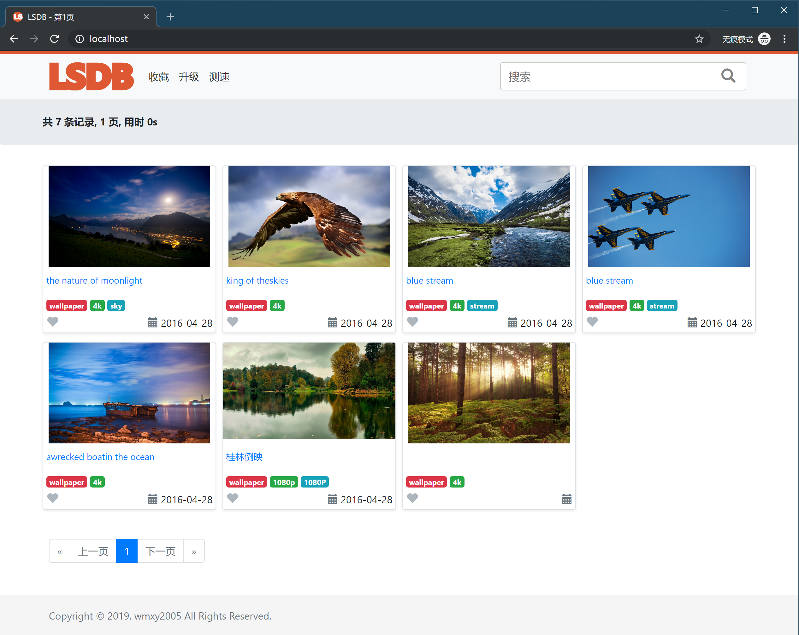

# [LSDB](https://github.com/wmxy2005/lsdb)

使用SQLite索引本地资源，主要页面为总览页面和详细页面，以及资源获取页面

- search.php，主查询页面
- detail.php，详情页面
- query.php, 资源获取页面

其他
- speedtest.php, 添加测速 [speedtest](https://github.com/adolfintel/speedtest)

备注
bootstrap-5.3.0

